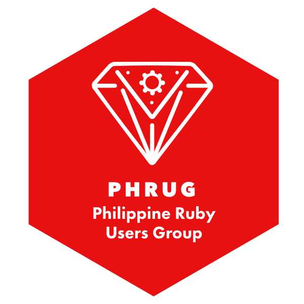

# Philippine Ruby Users Group

## Files

* [logos/](logos/) - various variations of the logo
* [sticker/](sticker/) - print-ready hexagon sticker

Designer notes: SVG files will need to have strokes expanded first, sorry :(
(In Affinity: *Layer > Expand Stroke*; in Sketch: use *Edit > Scale...* to scale it; to in Illustrator: *Object > Expand Appearance*)

## Colors

* Red: `#e71111`
* White: `#ffffff`

## Typography

* Avenir Next 900
* Futura PT 900
